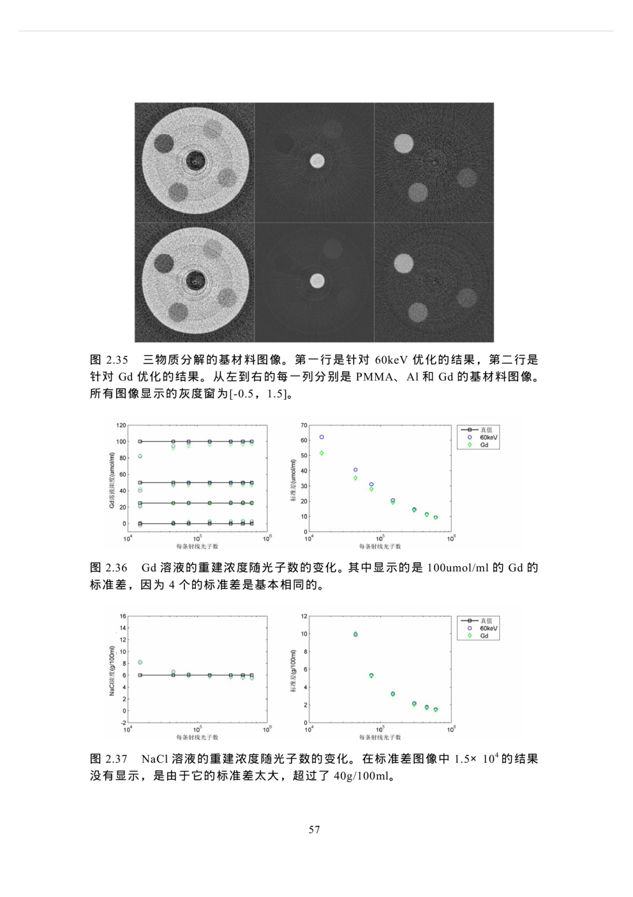
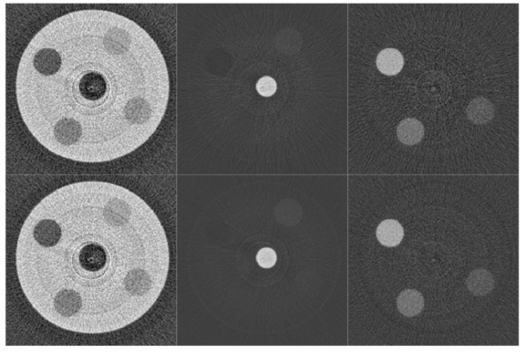
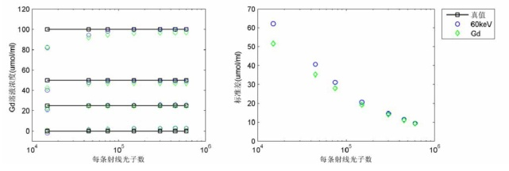
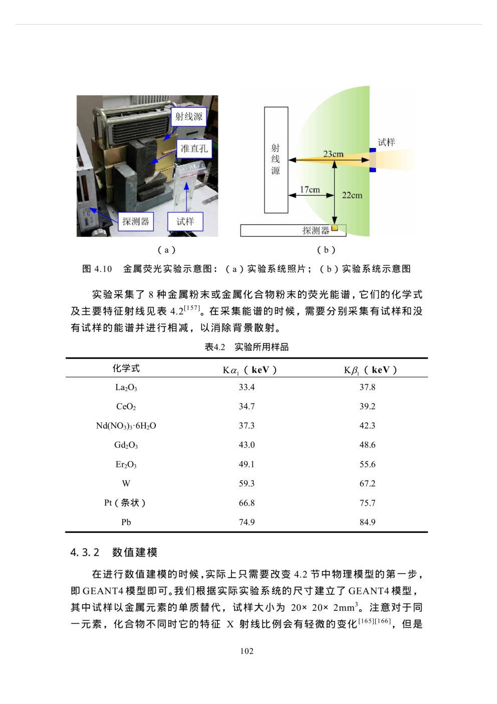
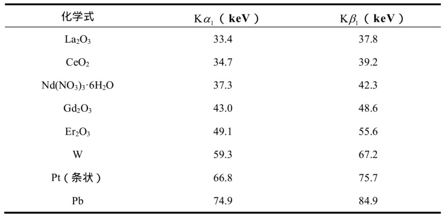

# PDF Figure and Table Extraction (Graduation Design)

## This project aims to extract figures and tables from PDF files, it will also find the coressponding subscript. The next step should be finding the description over the global context.

## Fundamentals
1. Using ResNet50_Segnet to detect Image and Table area in a PDF file, especially for scientific papers
2. Using CNOCR which is based on CRNN to extract tags and related information. (More NLP work is required to further this project)
3. Self-developed algorithm to deal with the adhesion areas
4. Failure area recontruction and second extract

## Getting Started

### Installing
```
git clone https://github.com/Alpha-Monocerotis/PDF_FigureTable_Extraction
pip install -r requirements.txt
```

### Download the pretrained model (Currently only support Resnet50-Segnet)

If you cannot have a good connection, you can download it by yourself in repo"s release or use wget(Linux).

```
wget -p ./models https://github.com/Alpha-Monocerotis/PDF_FigureTable_Extraction/releases/download/v1.0/resnet_segnet_1.0
```

### Using extract.py
open extract.py and write a line of code like below:

```
extract_single_image("./examples/Material28_images_14.jpg")
```
Then run the file and have fun!

## Usage
### Here I have some examples to show results. The original pdf pages are like [examples/Material28_images_66.jpg](examples/Material28_images_66.jpg) and [examples/Material28_images_111.jpg](examples/Material28_images_111.jpg):

#### [Material28_images_66.jpg](examples/Material28_images_66.jpg)

### Then after extraction, we have the following:


#### [examples/图2.35.jpg](examples/图2.35.jpg)


#### [examples/图2.36.jpg](examples/图2.36.jpg)


#### [examples/图2.37.jpg](examples/图2.37.jpg)


### Second page


#### [Material28_images_111.jpg](examples/Material28_images_111.jpg)

### The result shoud be:


#### [examples/图4.10.jpg](examples/图4.10.jpg)

#### [examples/表4.2.jpg](examples/表4.2.jpg)


### Our [log file](examples/log.txt) will generate the following:
```plain
图2.35三物质分解的基材料图像。第一行是针对60keV优化的结果，第二行是针对Gd优化的结果。从左到右的每一列分别是PMIMA、Al和Gd的基材料图像。所有图像显示的灰度窗为[-0.5，1.5]。 Material28/图2.35.jpg
图2.36Gd溶液的重建浓度随光子数的变化。其中显示的是100umaol/ml的Gd的标准差，因为4个的标(准差是基本相同的。 Material28/图2.36.jpg
图2.37NaCl溶液的重建浓度随光子数的变化。在标准差图像中1.5×10*的结果没有显示，是由于它的标准差太大，超过了40g/100ml。 Material28/图2.37.jpg
图2.35三物质分解的基材料图像。第一行是针对60keV优化的结果，第二行是针对Gd优化的结果。从左到右的每一列分别是PMIMA、Al和Gd的基材料图像。所有图像显示的灰度窗为[-0.5，1.5]。 Material28/图2.35.jpg
图2.36Gd溶液的重建浓度随光子数的变化。其中显示的是100umaol/ml的Gd的标准差，因为4个的标(准差是基本相同的。 Material28/图2.36.jpg
图2.37NaCl溶液的重建浓度随光子数的变化。在标准差图像中1.5×10*的结果没有显示，是由于它的标准差太大，超过了40g/100ml。 Material28/图2.37.jpg
图4.10金属荧光实验示意图:（a）实验系统照片;（b）实验系统示意图 Material28/图4.10.jpg
表4.2实验所用样品 Material28/表4.2.jpg
```


## Future Work

* [x] Single page mode
* [x] Double page mode
* [x] Double page mode subscript extraction optimization
* [x] Bugfixes
* [ ] NLP Global Context Analysis

## Reference
* https://github.com/divamgupta/image-segmentation-keras
* https://github.com/breezedeus/cnocr

